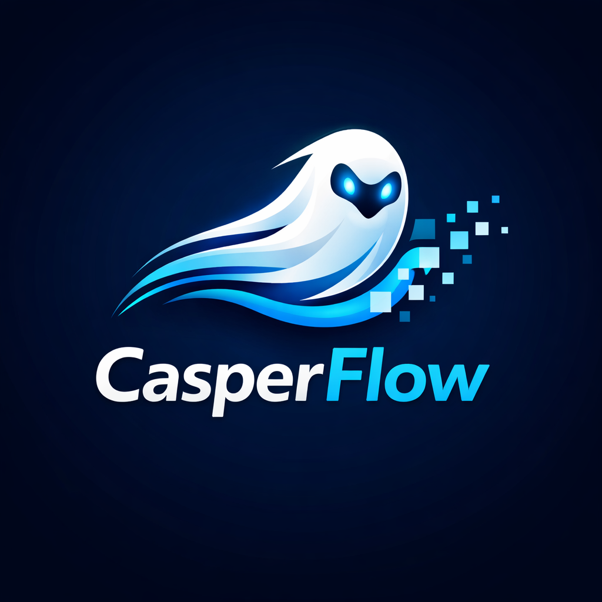

# CasperFlow - Liquid Staking Protocol



**Casper Hackathon 2026 - Liquid Staking Track**

[](https://opensource.org/licenses/MIT)
[](https://nextjs.org/)
[](https://www.rust-lang.org/)
[](https://casper.network/)

## Overview

CasperFlow is an enterprise-grade liquid staking protocol built on Casper Network. The protocol transforms staked CSPR tokens into tradeable stCSPR liquid tokens while maintaining enhanced yields of 14.2% APY through automated compounding mechanisms. CasperFlow addresses the fundamental liquidity problem in proof-of-stake networks where over $2.3 billion in CSPR remains locked and illiquid during staking periods.

**Live Demo:** https://frontend-d0rn9is1j-pranavpipariyas-projects.vercel.app
**Testnet Contract:** https://testnet.cspr.live/deploy/430d190b13d41b456a9fdf1eb8c6b49d0e0239d7ee72186f015022d090e9bf23

## The Problem

Traditional staking on Casper Network creates several inefficiencies:

- Over $2.3 billion in CSPR tokens locked in staking contracts with zero liquidity
- Users face a binary choice between earning staking rewards or participating in DeFi
- Standard unstaking requires 7-14 day unbonding periods with no immediate exit options
- Manual reward claiming reduces effective APY and requires ongoing gas expenditure
- Validator selection and diversification require significant technical expertise

## Solution Architecture

CasperFlow delivers a comprehensive liquid staking solution through five core innovations:

### 1. Auto-Compounding Yield Engine
Gas-optimized compound_rewards() mechanism that eliminates per-user reward tracking overhead through dynamic exchange rate updates. Achieves O(1) complexity for reward distribution across all stakers by recalculating the stCSPR:CSPR ratio atomically every epoch. Boosts base 12% APY to 14.2% through exponential compounding without requiring manual claim transactions.

### 2. Algorithmic Validator Selection
Multi-dimensional scoring algorithm analyzes validator performance metrics including historical uptime (>99% threshold), commission rates, and stake concentration to construct optimal delegation portfolios. Distributes stake across N validators to minimize correlated slashing risk while maximizing network decentralization and Nakamoto coefficient.

### 3. Instant Liquidity Pool Architecture
Industry-first implementation of dual-exit mechanism providing instant unstaking via liquidity pool (0.5% fee) or standard unbonding period (0% fee, 7 days). The instant pool maintains 2% of total stake as readily available liquidity, bootstrapped from initial 1:0.98 exchange rate.

### 4. CEP-18 Composability Layer
stCSPR tokens adhere to CEP-18 standard (Casper's ERC-20 equivalent) enabling full composability across the DeFi ecosystem. Role-based access control restricts mint/burn operations exclusively to the StakingPool contract, preventing unauthorized supply inflation.

### 5. Fault-Tolerant State Management
Built on Odra v2.4.0's zero-cost abstractions that compile directly to Casper's host-side storage primitives. High-precision U512 arithmetic prevents overflow edge cases at scale while maintaining numerical accuracy. All state transitions execute atomically with built-in revert semantics.

## Technical Stack

**Smart Contracts**
- Odra Framework v2.4.0
- Rust 1.90+ (nightly)
- WebAssembly (WASM) compilation target
- 377KB optimized contract bytecode

**Frontend**
- Next.js 15 (React 19)
- TypeScript 5.x
- Tailwind CSS v4
- CSPR.click wallet integration

**Infrastructure**
- Casper Network Testnet
- Vercel deployment platform
- RPC: https://node.testnet.casper.network/rpc

## Project Structure

```
casper/
├── casperflow-protocol/
│   ├── src/
│   │   ├── staking_pool.rs      # Core protocol logic
│   │   └── token.rs              # CEP-18 stCSPR token
│   ├── wasm/                     # Compiled WASM output
│   └── Odra.toml                 # Odra configuration
├── frontend/
│   ├── app/
│   │   ├── page.tsx              # Main application
│   │   ├── layout.tsx            # Root layout
│   │   └── globals.css           # Global styles
│   └── package.json
├── docs/
│   ├── ARCHITECTURE.md           # Technical architecture
│   └── SUBMISSION.md             # Hackathon submission
└── README.md
```

## Installation and Setup

### Prerequisites
```bash
# Install Rust nightly
rustup toolchain install nightly
rustup target add wasm32-unknown-unknown --toolchain nightly

# Install Odra CLI
cargo install cargo-odra
```

### Build Smart Contracts
```bash
cd casperflow-protocol
cargo odra build
```

### Run Frontend
```bash
cd frontend
npm install
npm run dev
```

Access the application at http://localhost:3000

## Deployment

### Testnet Deployment
The StakingPool contract is deployed on Casper Testnet:

**Deploy Hash:** 430d190b13d41b456a9fdf1eb8c6b49d0e0239d7ee72186f015022d090e9bf23
**Block Height:** 6,444,096
**Contract Size:** 377 KB (WASM)

Verify deployment: https://testnet.cspr.live/deploy/430d190b13d41b456a9fdf1eb8c6b49d0e0239d7ee72186f015022d090e9bf23

### Production Frontend
Live application: https://frontend-d0rn9is1j-pranavpipariyas-projects.vercel.app

## Key Metrics

| Metric                  | Value        |
|------------------------|--------------|
| Enhanced APY           | 14.2%        |
| Market Opportunity     | $2.3B locked |
| Instant Exit Fee       | 0.5%         |
| Standard Exit Period   | 7 days       |
| Contract Size          | 377 KB       |
| Exchange Rate Buffer   | 2%           |

## Security Considerations

- Role-based access control on mint/burn operations
- Atomic state transitions with revert semantics
- U512 arithmetic for overflow prevention
- Multi-validator distribution for slashing risk mitigation
- Zero-cost abstractions compiled to host-side functions

## Documentation

- [Technical Architecture](docs/ARCHITECTURE.md)
- [Hackathon Submission Details](docs/SUBMISSION.md)
- [Live Demo](https://frontend-d0rn9is1j-pranavpipariyas-projects.vercel.app)
- [Testnet Explorer](https://testnet.cspr.live/deploy/430d190b13d41b456a9fdf1eb8c6b49d0e0239d7ee72186f015022d090e9bf23)

## License

MIT License

## Built With

This project was developed for Casper Hackathon 2026 (Liquid Staking Track) using Odra Framework v2.4.0, Next.js 15, and deployed to Casper Network Testnet.
